# Arthemy Z-Image and Qwen Tuner

Advanced real-time control for **Z-Image** models and **Qwen3-4B** Text Encoders. These nodes perform "live surgery" on your model's weights to boost or lower specific generative phases without any training.

```
UPDATE 2.0.0 
The nodes have been completely reworked in order to solve many... many issues. Now they works as intended and you can also save your tuned z-image models and text-encoders.
```

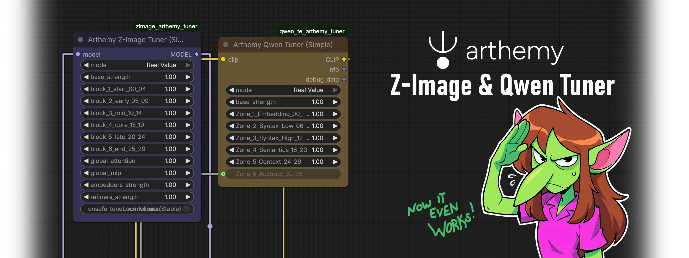

---

Hi everyone!

I developed these nodes to slice the monolithic **S3-DiT** of **Z-Image** to give you more control over different slices of both the Model and Text Encoder.
This transform your **Z-Image** model into a set of "Sliders," allowing you to tweak composition, lighting, or micro-details in real-time.

You can finally **play with the models**!

*Work in Progress: Please keep in mind that the boundaries for these functional blocks are experimental. Since Z-Image is a single-stream architecture... it's quite chaotic.
If you want more freedom and help us all understand what's really inside each slice of Z-image and Qwen, feel free to play with the "LAB" version, where you can control every layer indipendently.*

---
```
Prompt for the examples: 
American comic book art, Western illustration style, highly detailed, dynamic line work. A powerful female elf standing in a dynamic pose, raising one arm high towards the sky. Her hand is encased in a bulky, complex mechanical gauntlet that crackles with arcs of blue electricity. She wears a sharp, fitted black uniform adorned with a thick, luxurious fur collar. Her vibrant green hair is styled with a heavy side-sweep that completely covers one eye. Small, delicate antlers frame the sides of her head. The perspective is a dramatic low angle looking up, emphasizing her dominance and the height of her reach. The background places her in the center of a cobblestone medieval square, but the low angle highlights a brilliant, clear summer sky dotted with fluffy white clouds behind her. The lighting is bright and natural sunlight, accented by the intense glow of the electrical sparks. The image conveys a strong sense of movement, with wind blowing through her hair and the surging energy of the gauntlet.
```

## 🧪 Z-Image Tuner (Simple)

The 30 layers of the model are divided into **6 Positional Blocks** (5 layers per block), plus controls for the auxiliary components that wrap around the main transformer.

**A. The Main Stack (Positional Blocks)**
You can push or pull the weights of these blocks relative to the `base_strength`.

* **Block 1 (Start 00-04):** Initial composition.
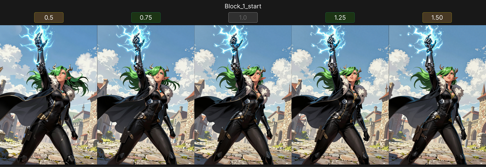
* **Block 2 (Early 05-09):** Early feature definition.
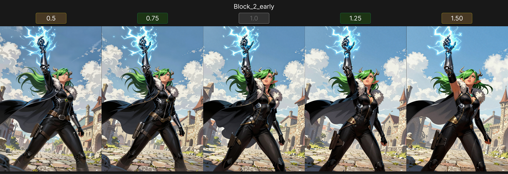
* **Block 3 (Mid 10-14):** Mid-level structure.
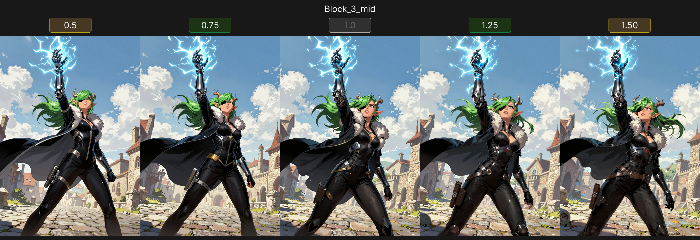
* **Block 4 (Core 15-19):** Core processing.

* **Block 5 (Late 20-24):** High-level details.
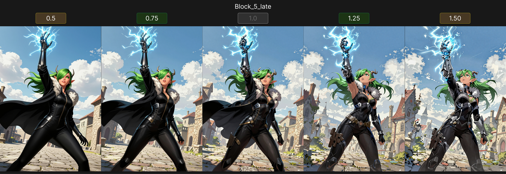
* **Block 6 (End 25-29):** Final output resolution.
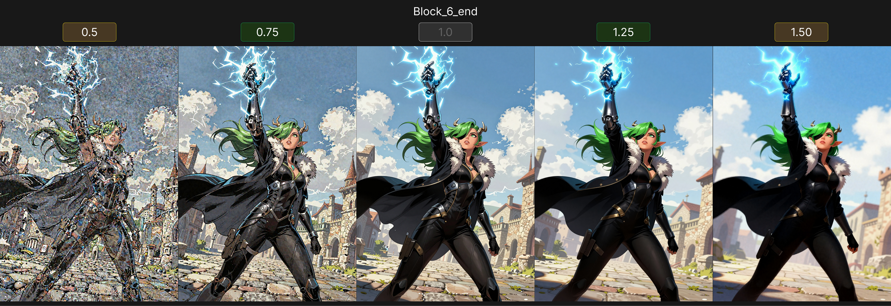

**B. Global Components**
Instead of affecting layers, you can scale specific internal mechanisms across the entire model:

* **Global Attention:** Scales the Attention mechanisms. This impacts how the model relates different parts of the image to each other.
* 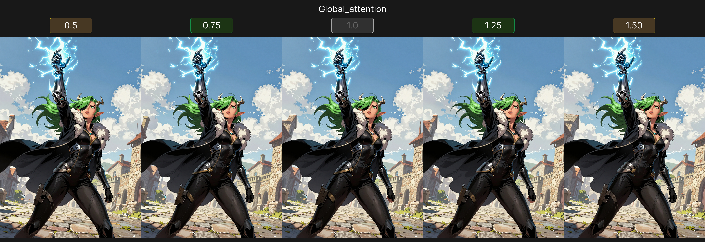
* **Global MLP:** Scales the Feed-Forward networks. This impacts the processing power of the individual nodes.
* 

**C. Auxiliary Models**
These controls target weights that exist outside the main 30-layer stack:

* **Embedders Strength:** Scales the internal embedding layers. This controls how strong the initial signal injection is before it enters the main layers.
* 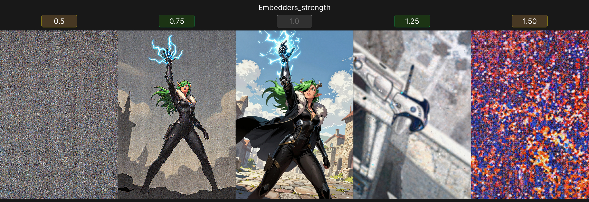
* **Refiners Strength:** Scales the dedicated refinement weights, often responsible for noise handling or context refining.
* 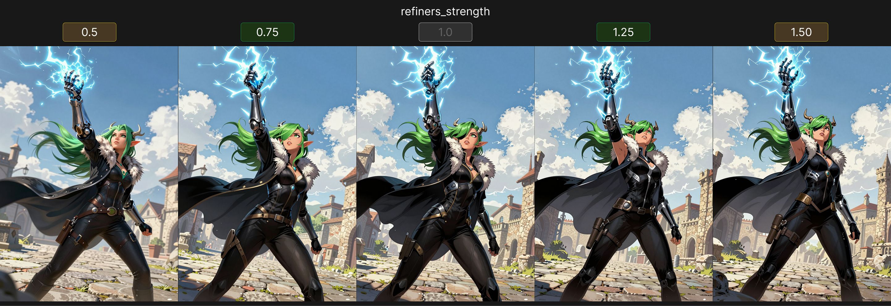

**⚠️ Safety Toggle:**

* **Unsafe Tune Normalization:** By default, this is **OFF** (Locked). Normalization layers stabilize the neural network; scaling them (changing their math) often leads to artifacts or "fried" images. Enable this only if you want to deliberately break the model's stability.

---

## 🧪 Qwen Tuner (Simple)

The Qwen3-4B text encoder has 36 layers. The v2.0 Tuner organizes these into **6 Semantic Zones** (6 layers per zone), moving from raw embedding to abstract reasoning.

* **Zone 1 (Layers 00-05):** Embedding & Tokenization
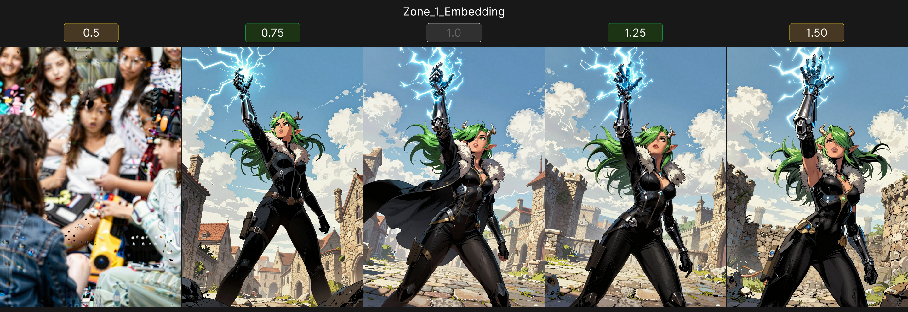
* **Zone 2 (Layers 06-11):** Low-Level Syntax
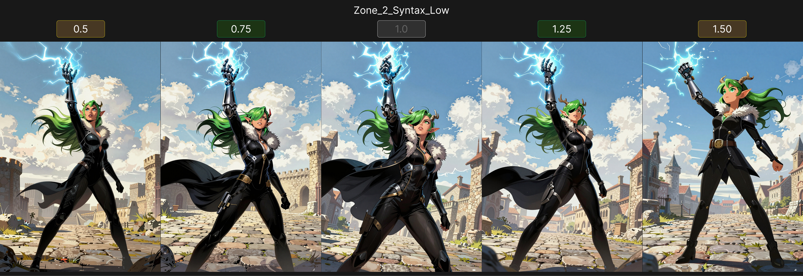
* **Zone 3 (Layers 12-17):** High-Level Syntax
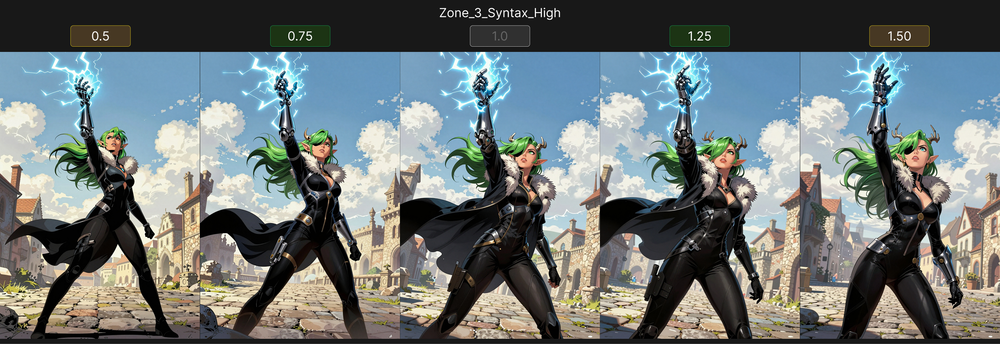
* **Zone 4 (Layers 18-23):** Semantics
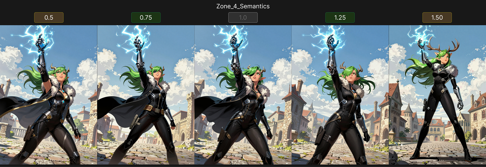
* **Zone 5 (Layers 24-29):** Contextual Logic
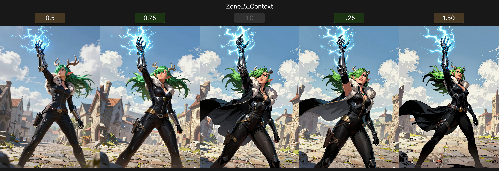
* **Zone 6 (Layers 30-35):** Abstract Reasoning
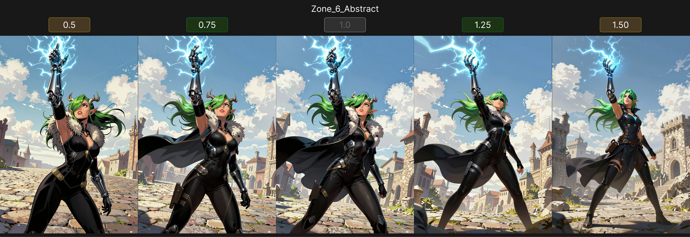

Adjusting these allows you to influence how strictly the model adheres to grammar versus how freely it interprets the "vibe" of your prompt.

---

But wait, there's more:


## ⚗️ Arthemy LAB Versions

For those curious **_FREAKS_** that want to look under the hood and customize their model with complete control:

The **LAB** versions of these nodes discard the groupings entirely. They expose:

1. **Layers 00-29** individually for the Z-Image Model.
2. **Layers 00-35** individually for the Qwen Text Encoder.

This is intended for research and fine-tuning. If you want to discover exactly which layer controls "lighting" or "texture" for a specific seed, this is where you experiment.

---

### 💾 Arthemy Savers

Once you have tuned your model or text encoder state in memory, you can use the **Z-Image Saver** or **Qwen Saver** nodes to serialize your changes into a standalone `.safetensors` file, ready to be loaded in other workflows.

---

## ⚠️ Arthemy Tuner Loader (Why you need it)

**Required for Z-Image Tuning**

This custom loader is critical for the **Z-Image Tuner**.
Standard ComfyUI loaders cache models in your RAM to speed up generation. However, because the Z-Image Tuner modifies weights "in-place" (live editing the model in memory), using the standard loader causes your adjustments to accumulate. If you run the tuner twice, you might accidentally apply your changes *on top* of the previous changes, "frying" the model.

The **Arthemy Tuner Loader** forces a "clean refresh" from the disk every time you run the workflow. It ensures that every tuning session starts from the pristine, original model file, preventing "dirty cache" corruption.

For the **Qwen Text Encoder**, you do **not** need the custom Loader.

---

## Installation

1. Navigate to your `ComfyUI/custom_nodes/` folder.
2. Run: `git clone https://github.com/aledelpho/ComfyUI-Arthemy-ZImage-Tuner.git`
3. Restart ComfyUI.

---
